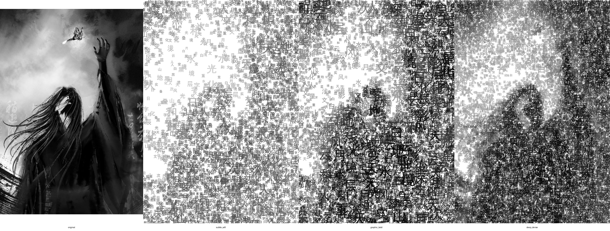

## Wordless – Layered Chinese Word Depth Exploration

Recreate and explore an image using **only Chinese words**, layered at different **sizes**, **densities**, and **alphas** to build a sense of depth and variation.

At the core of the project is an **evaluation strip** that compares several depth styles side‑by‑side:

|  |
|:-----------------------------------------------:|
|        **Original + Layered Word Variants**     |

---

### 📦 Repository Overview

This repo focuses on generating word‑based reinterpretations of an image and exploring their depth in both **static** and **animated** forms.

- **`main.py`** – core generator that recreates an image using layered Chinese words.
- **`generate_variations.py`** – produces multiple depth styles (e.g. subtle vs. graphic) and builds:
  - Individual variants such as `subtle_soft.png`, `graphic_bold.png`.
  - A combined `evaluation.png` (original + key variants) and `comparison.png` (a labeled strip).
- **`animate_depth_transition.py`** – creates an animated GIF where words **fly in from off‑screen**, settle into place, and gradually build up from **subtle** → **graphic** → **original**.
- **`example.jpg`** – example source image.
- **`variations/evaluation.png`** – evaluation strip for the current `example.jpg` (generated).
- **`requirements.txt`** – Python dependencies (Pillow).

This project is designed to be a small, visually driven “lab” for experimenting with **text‑only image reconstruction** and depth perception.

---

## 🖼 Static Depth Variations

### Core Generator (`main.py`)

`main.py` reads an input image, scales it to a chosen width, and rebuilds it using **overlapping Chinese characters**:

- Large, low‑density, semi‑transparent characters create the **global structure**.
- Medium characters refine **mid‑level shapes**.
- Smaller, denser characters sharpen **edges and dark regions**.

Basic usage (from the repo root, using `example.jpg`):

```powershell
python .\main.py --input ".\example.jpg" --output ".\output.png" --font "C:/Windows/Fonts/simhei.ttf" --max-width 1000
```

### Style Variants (`generate_variations.py`)

To compare different depth “looks” side‑by‑side:

```powershell
python .\generate_variations.py --input ".\example.jpg" --font "C:/Windows/Fonts/simhei.ttf" --max-width 1000
```

This generates (in the `variations/` folder):

- `subtle_soft.png` – smoother, softer reconstruction.
- `graphic_bold.png` – higher contrast, more poster‑like.
- `deep_dense.png` – very dense, engraved feel.
- `minimal_airy.png` – sparse, abstract, airy.
- `evaluation.png` – **original + key depth variants** in a single strip.
- `comparison.png` – comparison strip where the 4th panel is the full evaluation sheet.

You can restrict to specific styles, e.g.:

```powershell
python .\generate_variations.py --input ".\example.jpg" --font "C:/Windows/Fonts/simhei.ttf" --styles subtle_soft graphic_bold
```

---

## 🎬 Animated Depth Transition

`animate_depth_transition.py` turns the layering process into a **short animation**:

- Words start **off‑screen**, **fly in** toward their assigned positions, and **settle**.
- Layers are added in sequence: **`subtle_soft` → `graphic_bold`**, then the animation **fades into the original**.
- A small amount of blur during motion frames sells the feeling of emerging structure.

Run it like this:

```powershell
python .\animate_depth_transition.py --input ".\example.jpg" --font "C:/Windows/Fonts/simhei.ttf" --max-width 800 --output-gif "depth_transition.gif"
```

Tuning options:

- `--frames-per-layer` – more frames per layer = smoother, slower build‑up.
- `--final-original-frames` – how long the fade into the original lasts.

The result is an animated **GIF** (e.g. `depth_transition.gif`) that shows the image “coming together” purely from words.

---

## 🔧 Installation

- **Python**: 3.9+ recommended.
- **Dependencies**:

```bash
pip install -r requirements.txt
```

On Windows PowerShell:

```powershell
pip install -r .\requirements.txt
```

### Choosing a Chinese Font (Windows)

Use a font that supports Chinese characters, for example:

- `C:\Windows\Fonts\simhei.ttf`
- `C:\Windows\Fonts\msyh.ttc`
- `C:\Windows\Fonts\simkai.ttf`

Pass the chosen path via `--font` to all scripts.

---

## 🧱 Project Structure

```text
.
├─ main.py                     # Core word-based reconstruction
├─ generate_variations.py      # Style presets + evaluation/comparison strips
├─ animate_depth_transition.py # Flying-word animation → GIF
├─ requirements.txt            # Python dependencies (Pillow)
├─ example.jpg                 # Example source image (not tracked in code)
└─ variations/                 # Generated outputs (evaluation, comparison, variants, GIFs)
```

---

## 💡 Ideas & Extensions

- Swap the Chinese character set for **custom word banks** (e.g. themes, poetry, single concepts).
- Add **color mapping** so darker areas use warmer hues, lighter areas cooler hues.
- Export higher‑resolution evaluation strips for print or large‑format displays.

---

